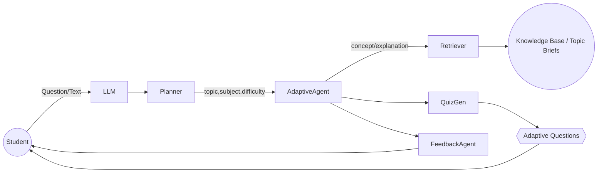

# Personalized AI Tutor – Multi-Agent Workflow

This document captures the end-to-end workflow for the Agentic AI Tutor so we can extend it with future capabilities such as face-to-face doubt sessions and richer multimodal modalities (text ↔ text, speech ↔ text, video guidance, etc.).

## 1. Student Interaction Layer

| Channel | Flow | Notes |
| --- | --- | --- |
| Text ✍️ | Student types a question/topic → FastAPI `/ask` | Existing Streamlit UI |
| Speech 🎤 | Student records audio → Voice Activity Detection (VAD) → Speech-to-Text (STT) → text pipeline | Future addition |
| Face-to-face Doubt Session 🧑‍🏫 | Student joins live session (WebRTC/Video conferencing) → tutor streams explanations + dynamic board | Planned |

All interactions funnel into the central LLM Orchestrator after optional translation or transcription.

## 2. Multimodal Pre-processing

1. **STT Service** (Speech-to-Text): Converts spoken questions to text; bypassed when VAD detects silence.
2. **Translation Layer**: Applies user-preferred language mapping so the tutor works globally.
3. **Text Normalization**: Ensures topic + subject metadata are extracted for the downstream planner.

## 3. Core Reasoning Loop

- **Planner Agent**: infers/validates topic, subject, and difficulty from either explicit metadata or question text.
- **Adaptive Learning Agent**: selects current concept, references conversation history, and orchestrates other agents.
- **Retriever Agent**: fetches curated or auto-generated topic briefs (RAG or fallback generator).
- **Quiz Generator**: builds adaptive practice sets (text, numerical, or scenario-based). Future: add diagram/video prompts.
- **Feedback Agent**: explains why certain topics/questions were chosen and suggests next steps.

## 4. Teaching Content Orchestration

| Component | Responsibility |
| --- | --- |
| **Pedagogical Agent** | Aligns with curriculum, ensures spiral progression, updates teaching context once a concept is “finished.” |
| **Teaching Content Orchestrator** | Traverses subject → chapter → section → concept hierarchy; schedules upcoming modules. |
| **Education Content Store** | Structured knowledge base with metadata for sections, micro-concepts, and evaluation criteria. |

## 5. Engagement & Reinforcement Loop

1. **Engagement Agent**: monitors interaction metrics (time-on-task, question frequency).
2. **Reinforcement Agent**: issues motivational nudges or gamified rewards.
3. **Assessment Agent**: evaluates quizzes/tests, updates student skill profile, writes to progress DB.
4. **Feedback Loop**: adaptive agent ingests new scores + preferences → next session plan.

## 6. Face-to-Face + Text-to-Text Doubt Session Add-on

### 6.1 Live Doubt Session

- Launch **Face-to-Face Session Agent** (WebRTC):
  - Streams student video/audio.
  - Provides shared whiteboard for the tutor AI to annotate in real-time.
  - Integrates STT/TTS for accessibility and transcripts.
- Session transcripts feed back into conversation history for context continuity.

### 6.2 Text-to-Text Mode

- Dedicated **Doubt Resolution agent**:
  - Accepts snippet of student work or question.
  - Cross-references context evaluator to avoid repeated answers.
  - Summarizes conversation threads and highlights unresolved points.

## 7. Future Enhancements

- Plug in specialized video agents to generate micro-lectures per concept.
- Deploy Support AI Agent for escalation to human mentors.
- Add evaluation dashboards for teachers/parents with weekly reports.
- Integrate classroom mode: multiple students per session, with personalized follow-ups.

---

**Status:** living document – update this file whenever new modalities or agents are introduced, ensuring architectural alignment with the reference diagram.***

