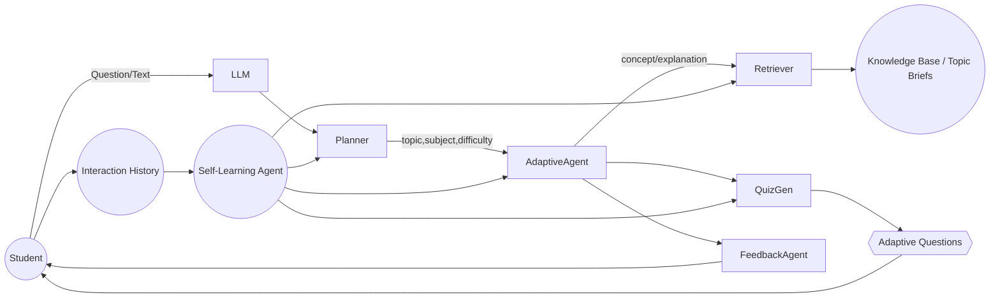

---

# **workflow.md – Personalized AI Tutor (Updated Architecture)**

This is a **living system architecture** for the Personalized Agentic AI Tutor. It includes text/speech/video modalities, multi-agent reasoning, reinforcement loops, live doubt sessions, and a **Self-Learning Engine** that improves continuously from historical data.

---

# **1. Student Interaction Layer**

| Channel                        | Flow                                            | Notes            |
| ------------------------------ | ----------------------------------------------- | ---------------- |
| **Text **                    | Student types in Streamlit UI → FastAPI `/ask`  | Existing feature |
| **Speech **                  | Audio → VAD → STT → Text → Core Pipeline        | Future roadmap   |
| **Face-to-Face Session 🧑‍🏫** | WebRTC video/audio → Shared board → Tutor agent | Planned feature  |

**All inputs (text/speech/video)** eventually reach the **LLM Orchestrator** with optional preprocessing.

---

# **2. Multimodal Pre-processing**

1. **STT Service (Speech-to-Text)**
   Converts voice queries to text; bypassed when silence is detected.

2. **Translation Layer**
   Auto-translates input into the tutor’s working language.

3. **Text Normalization**
   Extracts topic, subject, intent, and difficulty metadata for downstream agents.

---

# **3. Core Reasoning Loop (Updated)**

### **Agents**

### **Planner Agent**

* Identifies: subject, topic, difficulty, learning goal.
* Uses rules + historical patterns.

### **Adaptive Learning Agent**

* Chooses the right concept to explain.
* Uses past conversations + self-learning data.

### **Retriever Agent**

* Pulls curated notes, topic briefs, examples (RAG).
* Falls back to generator if missing.

### **Quiz Generator**

* Creates adaptive quizzes:

  * text questions
  * numericals
  * logical reasoning
  * future: diagrams/videos

### **Feedback Agent**

* Explains reasoning behind chosen content.
* Suggests next learning path.

---

# **4. Self-Learning Engine (New Feature)**

A continuous learning system that updates the tutor’s teaching strategy using previous data.

### **What It Learns**

* Student weaknesses per **subject**, **topic**, **micro-concept**
* Common mistakes per **question type**
* Which explanations were effective
* Preferred explanation style
* Student pace & attention patterns
* Difficulty level adaptation curve

### **What It Updates**

* Planner → more accurate difficulty estimation
* AdaptiveAgent → improved concept sequencing
* Retriever → prioritizes content that helped earlier
* QuizGen → questions mapped to weak areas
* Feedback → tailored improvement tips

### **Stored Data**

* Past queries
* Correct/incorrect answers
* Time spent on each step
* Doubts raised
* Session transcripts
* Performance graphs

### **Outputs**

* Learner Profile Embedding
* Concept Mastery Map
* Difficulty Progression Curve
* Pedagogical Preference Model

---

# **5. Teaching Content Orchestration**

| Component                   | Role                                                                  |
| --------------------------- | --------------------------------------------------------------------- |
| **Pedagogical Agent**       | Ensures structured learning (curriculum → chapter → concept).         |
| **Content Orchestrator**    | Schedules topics, revisits weak concepts, handles spiral progression. |
| **Education Content Store** | Stores sections, micro-concepts, examples, diagrams, test cases.      |

### **Self-Learning Integration**

* Topics selected based on weakness matrix
* Explanations optimized for student's past learning response
* Automatically slows down or speeds up instruction

---

# **6. Engagement & Reinforcement Loop**

1. **Engagement Agent**

   * Tracks time-on-task, confusion points, drop-off moments.

2. **Reinforcement Agent**

   * Sends nudges, motivation, gamified rewards.
   * Customizes tone and intensity using self-learning signals.

3. **Assessment Agent**

   * Grades quizzes/tests.
   * Generates mastery scores and performance vectors.

4. **Feedback Loop**

   * AdaptiveAgent uses new data → next session planning.
   * Self-Learning Engine updates learner profile continuously.

---

# **7. Face-to-Face + Text-to-Text Doubt Sessions**

## **7.1 Live Doubt Session (WebRTC)**

* Two-way video/audio streaming
* AI tutor draws on shared whiteboard
* STT + TTS integrated
* Real-time transcript stored → Self-Learning Engine

## **7.2 Text Doubt Resolution**

* Snippet-based question solving
* Context evaluator avoids repetition
* Highlights unresolved doubts
* Summarizes entire doubt conversation

---

# **8. Future Enhancements**

* Automated micro-lecture video generator
* Human mentor escalation agent
* Parent/teacher analytics dashboards
* Classroom mode (multi-student sessions)
* Student motivation model using RL
* Auto-difficulty progression via predictive modeling

---

